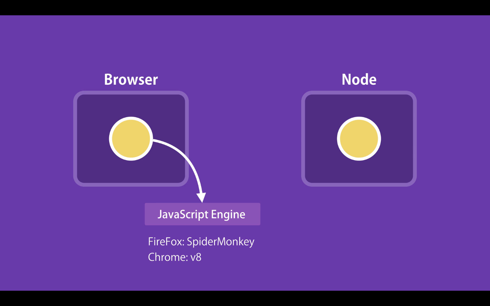
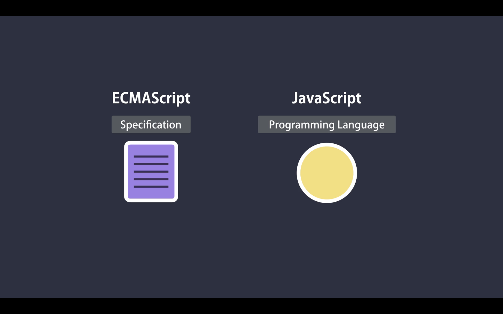

# 02- What is JavaScript

## What is JavaScript?

Is one of them most popular and wildly used programming languages. You can work as a Front-end developer, back-end developer, or full-stack developer.

## Whats can you do with it?

In the early days JavaScript was only used in the browsers to build interactive webpages. Back then some developers refereed to JavaScript as a "toy language"
But is evolved so much, due to companies and community support, that this days we can build:

- Full Web / Mobile apps
- Real-time Networking apps
- Command-line tools
- Games

## Where does Javascript run?

JavaScript as original design to run only in browsers. In 2009 a engineer called Ryan Doll took the open source JS code from Google Chrome V8 JvaScript engine and embedded it inside a C++ program. He called that program Node. So Node is a C++ program that includes Google Chrome V8 JvaScript engine. With this we can run JavaScript outside the browser. Browser and Node provide a rutim environment to run JavaScript.

## Whats is ECMAScript?

ECMAScript is a specification, and JavaScript is a programing language that confirms to that specification. The first version of ECMAScript was released in 1997, than starting from 2015 they have been working on anual releases of new specification. So in 2015 they released ES2015/ES6.

