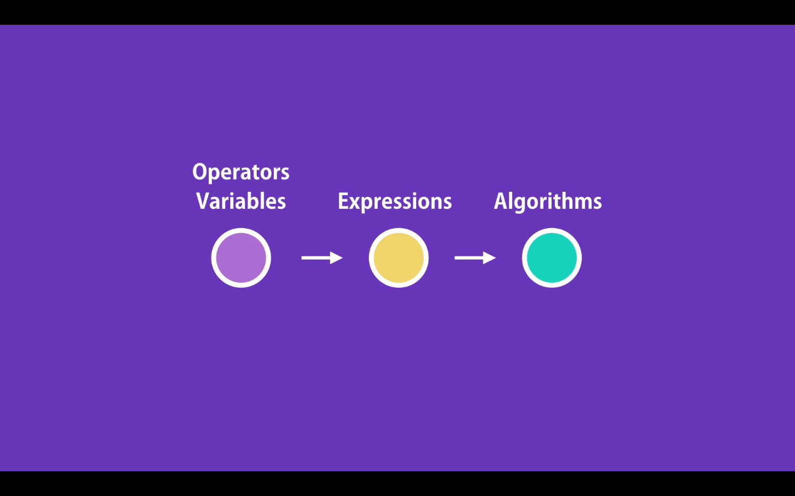

# 01- JavaScript Operators

In JavaScript we different kinds of Operators. We use this operator with our variables to create expressions and with these expressions we can implement logic and Algorithms

Kinds of operators:

- Arithmetic
- Assignment
- Comparison
- Logical
- Bitwise
